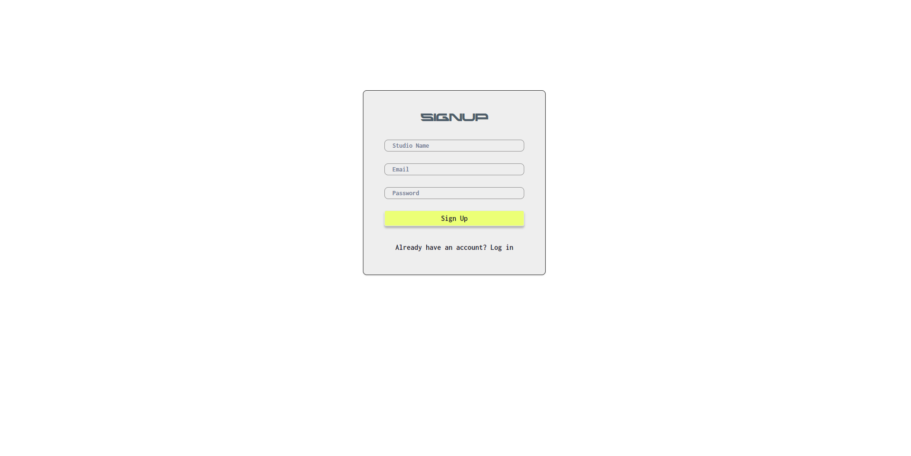
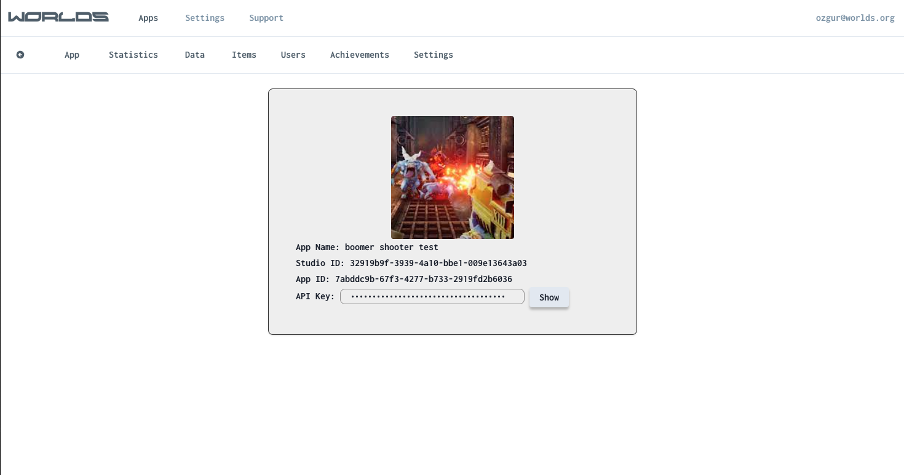
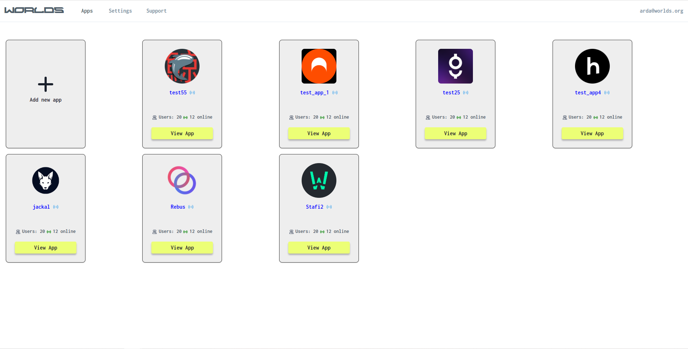
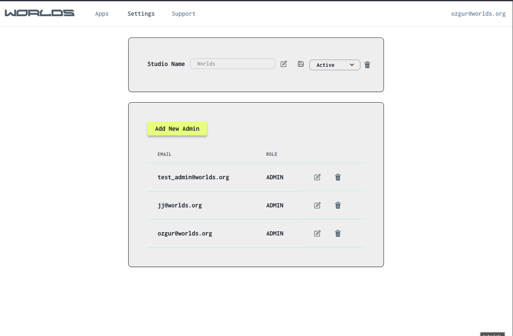

## Worlds Game Services UI

This is the ui app of the Worlds Game Services project.

### [Live Link](https://wgs-next.vercel.app/)

---

### Technologies

- Next.js
- Typescript
- Context Api
- Supabase
- React
- Chakra UI
- Axios
- Formik
- Yup

---

## Installation

1- Clone this repo, install dependencies.

```makefile
gh repo clone https://github.com/Manifest-Git/wgs-next.git
npm i
# or
yarn
# or
pnpm dev
```

2- Create .env file like;

```makefile
NEXT_PUBLIC_SUPABASEURL = <Supabase Url>
NEXT_PUBLIC_SUPABASEKEY = <Supabase Key>
NEXT_PUBLIC_API_BASE_URL = <WGS Server Base Url>
NEXT_PUBLIC_SERVICEROLEKEY =<Supabase Service Role Key>
X_API_KEY = <X API KEY>
```

3- Build and run project;

```makefile
npm run dev
# or
yarn dev
# or
pnpm i
```

---

## Screenshots






## Videos

- [Data Page](https://www.loom.com/share/bb572731d8be4970af9fc1a346901797)
- [Items Page](https://www.loom.com/share/766ceb47d05f42a3aafc3d3cf3ea1a36)
- [Users Page](https://www.loom.com/share/4eb4d6e3c26d4a8e974afbb37f5a6cb1)
- [Statistics Page](https://www.loom.com/share/93889ddff6a54e5b88d48841cb71301f)
